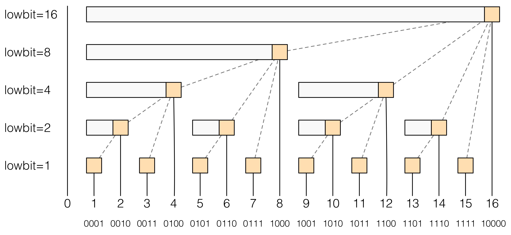

# Binary Indexed Tree

## Introduction:

A Fenwick tree or binary indexed tree is a data structure that can efficiently update elements and calculate prefix sums in a table of numbers.

### 1. `lowbit()` function

Mathematical expression:
$$lowbit(x) = x \& (-x)$$

Example table:
Integer | Binary | lowbit
:--- | :--- | :---
1 | 000**1** | 1
2 | 00**10** | 2
3 | 001**1** | 1
4 | 0**100** | 4
5 | 010**1** | 1
6 | 01**10** | 2
7 | 011**1** | 1
8 | **1000** | 8

### 2. Structure

